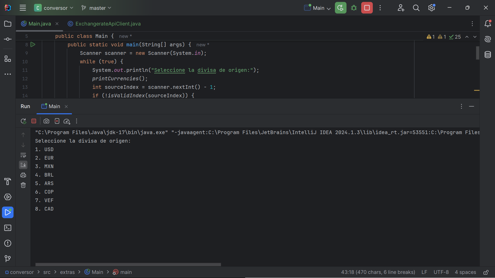
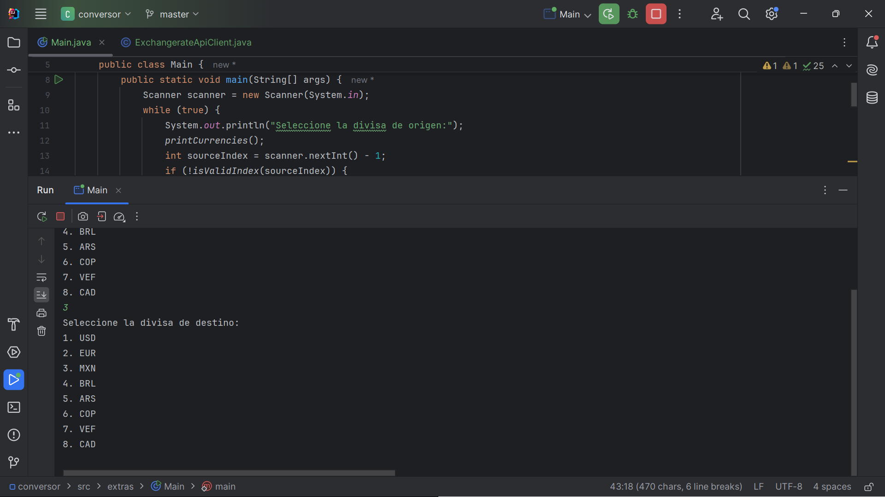
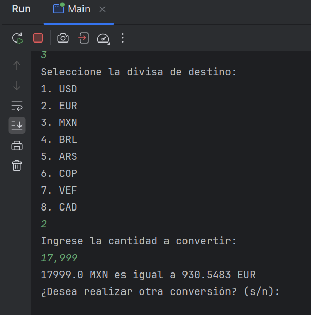
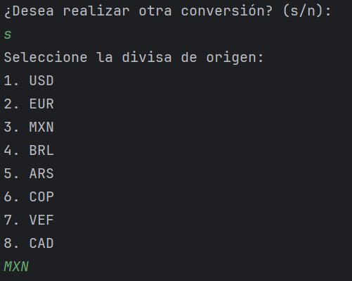
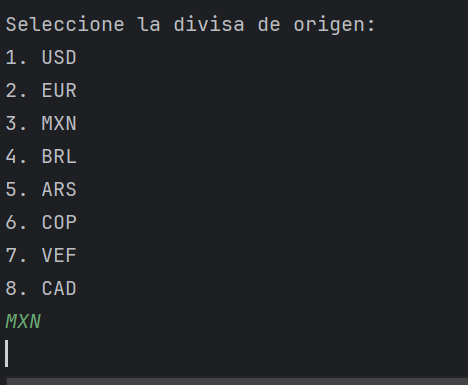
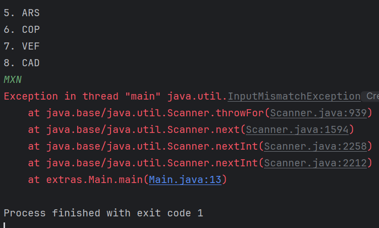
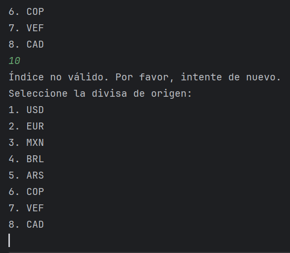
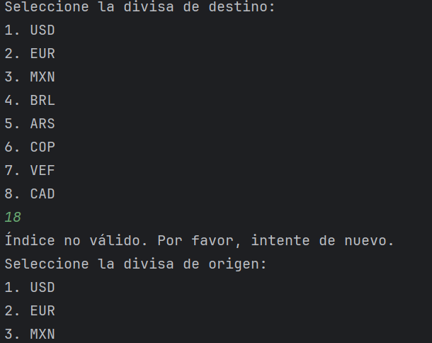
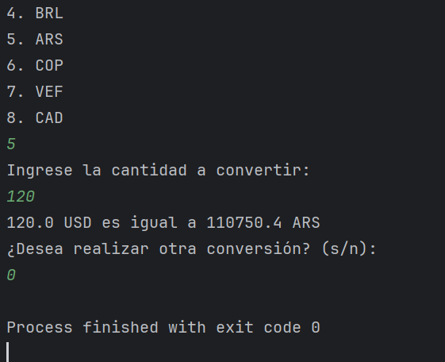

# conversor_divisas
Desafío de la formación Alura Latam OracleNextEducation enfocado en el consumo de una API.

## 📖 Conversor de Monedas
Este es un primer proyecto enfocado en el consumo y manipulación de una API. El programa permite convertir cantidades de las principales divisas del mundo. Utiliza una API de tipo de cambio para obtener las tasas de conversión actuales.

## 🔨 Funcionamiento
El programa solicita al usuario que elija una opción de conversión entre diferentes monedas. A continuación, se detallan las opciones disponibles:

Corremos nuestro programa en IntelliJ. Se despliegan inmediatamente las principales opciones de divisas por el código guardado en la API:

Seleccionamos un número. Enseguida nos pide seleccionar la divisa a la que queremos convertir. Seleccionamos otro número:

Ingresamos la cantidad a convertir. El programa acepta número separados por coma o no. El programa hace la converción:

Como está en un bucle, nos pide si queremos hacer otra conversión. Podemos poner que sí para ahora analizar otros valores. ¿Qué pasa si ingresamos el código de la divisa?:

El programa no compila e inmediatamente muestra un mensaje de error que nos saca del sistema (debemos tratar esa opción):

Tenemos considerado el caso donde el usuario no ingresa un valor numérico válido:

Ingresamos un valor fuera del rango en la segunda elección:

El proceso se repite y finaliza exitosamnte:

						
## ✔️ Requisitos
Java JDK 8 o superior
API Exchangerate

## 👨‍💻 Limitaciones y Consideraciones
El programa puede mostrar errores si la clave de API no es válida o si la API restringe el acceso.
Las tasas de cambio obtenidas de la API pueden no estar actualizadas en tiempo real.
Esta es una primer versión que cumple el objetivo de trabajar con peticiones API rest. Se mejorará el proyecto.

## 🏰 Sobre el Autor
Guz Mexía, mexicano radicado en Francia que busca dar un giro en su carrera profesional aprendiendo sobre tecnología. 

Aplicación muestra en video...
 
